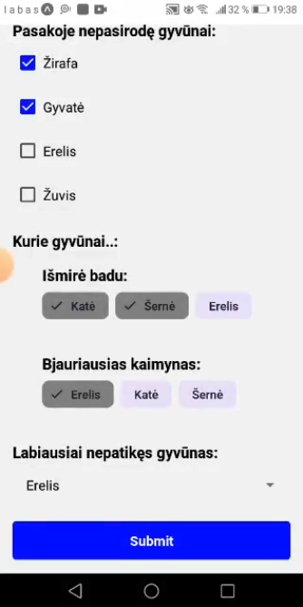
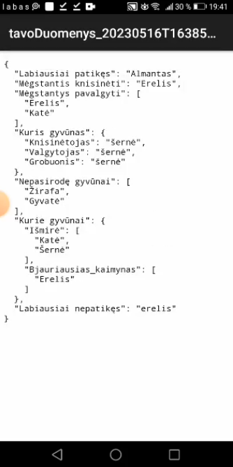
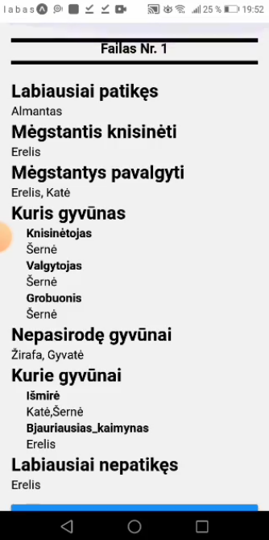

# JSON Handler

## Project Overview

The project consists of **two mobile applications** built with React Native using Expo, aimed at facilitating the handling of JSON data generated from user interactions. 
This is my **fourth semester project**.

The first app, `JSON_converter`, allows users to fill out a questionnaire, capturing their responses through input methods like text fields, checkboxes, radio buttons an etc. 
Upon submission, the responses are compiled into a JSON format file, which can then be downloaded in .txt format.

The second app, `JSON_parser`, is designed to interpret the downloaded JSON file, transforming the data into a more user-friendly format for easier understanding.

## Features

- **JSON Converter**
  - Users can fill out forms with various input types;
  - After submitting the questionnaire, user responses are compiled into a JSON format;
  - For mobile users, a Dropbox link is provided for file download, as Expo Go doesn't support direct file downloads to mobile devices.
    On web platforms (for testing purposes), users can download the JSON file directly to their device;
  - The app supports uploading the `.txt` file to Dropbox (on mobile).

- **JSON Parser**
  - Users can upload the `.txt` file generated by the `JSON_converter` app;
  - Transforms JSON data into a user-friendly, readable format;
  - Efficiently handles and displays nested JSON structures, ensuring complex data is parsed and presented in a clear manner;
  - Users can select and parse multiple files, with the app providing clear separation and display of each file’s content.

## Technologies Used

- **React Native**: For building both mobile applications;
- **Expo**: To simplify development and testing;
- **Dropbox API**: To manage file uploads and downloads;
- **CSS**: For styling the apps;
- **JavaScript**: For functionality and data handling.

## Setup and Installation

1. Clone this repository:
   `git clone https://github.com/A-Kederys/JSON-Handler.git`
2. Install Dependencies:
   - Make sure you have [Node.js](https://nodejs.org/) installed;
   - Navigate to each app's folder and run:
     `npm install`
3. Install Expo CLI:
   - If you haven't installed Expo CLI yet, run:
     `npm install -g expo-cli`
4. Run the Applications:
   - Start the Expo development server by running:
     `npm start` or `expo start`
   - Scan the QR code displayed in the terminal using the [Expo Go](https://play.google.com/store/apps/details?id=host.exp.exponent) app;
   - For web testing, you can choose to run it in a web browser, locally, link is displayed under the QR code.
5. Set Up Dropbox:
   - Ensure you have a Dropbox account and [set up an API key](https://www.dropbox.com/developers/apps), with individual permission scopes, for file management, if using Dropbox functionalities;
   - Individual permission scopes, that I checked manually:
     - *files.metadata.write*
     - *files.content.write*
     - *files.content.read*
     - *sharing.write*
     - *file_requests.write*

## How to Use

#### JSON Converter
1. Read the [fairy tale](https://www.pasakos.lt/erelis-kate-ir-serne/)
2. Open the `JSON_converter` app;
3. Fill out the questionnaire based on the fairy tale;
4. Submit your responses - a JSON file will be created from your answers;
5. Download the JSON file via the *Download* button.

#### JSON Parser
1. Open the `JSON_parser` app;
2. Upload the `.txt` file generated by the `JSON_converter` app;
3. You can select and parse multiple files, each file's content will be separated.
